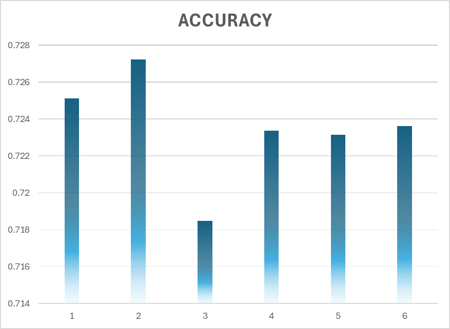

# Nonprofit foundation Alphabet Soup 

# Module 21 Report 

## Overview of the Analysis

The purpose of the analysis was to build a model that can help Alphabet Soup select the applicants for funding with the best chance of success in their ventures. 
For the analysis and building a model of historical dataset has been used from Alphabet Soup’s business team, containing more than 34,000 organizations that have received funding from Alphabet Soup over the years.

Date set included following relevant information:

    -  EIN and NAME - Identification columns
    - APPLICATION_TYPE—Alphabet Soup application type
    - AFFILIATION—Affiliated sector of industry
    - CLASSIFICATION—Government organization classification
    - USE_CASE—Use case for funding
    - ORGANIZATION—Organization type
    - STATUS—Active status
    - INCOME_AMT—Income classification
    - SPECIAL_CONSIDERATIONS—Special considerations for application
    - ASK_AMT—Funding amount requested
    - IS_SUCCESSFUL—Was the money used effectively

### Method used

To predict the chance for success a neural network model has been designed. 
Choice was motived by a few factors:
    1. Complex Relationships in Dataset e.g.: non linear Relationships
    2. Large amounts of Data / High dimensional data
    3. High Accuracy Needs

The process involved:

    1. Preprocessing
    2. Determining the target of the model (success of the funding) and identifying the most important features like income_amt, ask_amt
    3. Dropping irrelavant data / columns
    4. Using pd.get_dummies to encode categorical variables
    5. Splitting the data - dividing the dataset into training and testing sets using a 75%-25% split with train_test_split to ensure reproducibility
    6. Defining the model: Number of input features, layers
    7. Compling and trainging the model: fitting the neural network model to the training data.
    8. Prediction: Using the trained model to predict success  of fundraising.

## Results

1. Manual model with 2 hidden layers and respectively 80 and 30 neurons:

    * we have achieved following scores:
        1. Accuracy : 0.7251312136650085
        2. Loss: 0.5620238780975342

2. Authomatic mehtod that creates a sequential model with hyperparameters options (within the first AlphabetSoupCharity_Solution file):

    * we have achieved following scores:
        1. Accuracy : 0.7272303104400635
        2. Loss: 0.559550404548645

## Optimization:

3. 1st Approach (file AlphabetSoupCharity_Optimization_1):

        - dropping more non beneficial columns: 'EIN', 'NAME', 'SPECIAL_CONSIDERATIONS', 'ORGANIZATION'
        - binning ASK_AMT column with originally 8747 various values
        - creating 3 hidden layers in NN Model

        # Results:
            - Accuracy : 0.7184839844703674
            - Loss: 0.5907972455024719

4. 2nd Approach (file ApphabetSoupCharity_Optimization_2):

        - dropping even more non beneficial columns: 'EIN', 'NAME', 'SPECIAL_CONSIDERATIONS', 'STATUS', 'ORGANIZATION'
        - creating 2 hidden layers (80 and 30 neurons) in NN Model, and running it with 200 Epochs

        # Results:
            - Accuracy : 0.7233819365501404
            - Loss: 0.5782853364944458

5. 3rd Approach (file ApphabetSoupCharity_Optimization_2) Model1:

        - creating a model with 3 hidden layers (80,50,20 Neurons respectively) and 100 Epochs 

        # Results:
            - Accuracy: 0.7231487035751343
            - Loss: 0.5769910216331482

6. 4th Approach (file ApphabetSoupCharity_Optimization_2)

        - Authomatic mehtod that creates a sequential model with hyperparameters options.

        # Results:
            - Accuracy: 0.7236151695251465
            - Loss: 0.5666126012802124

            

## Summary

As seen on the attache picture non of the attemps to optimize the model were succesfull. The best scored was achieved in the attept no2, with uthomatic mehtod that created a sequential model with hyperparameters options.
However even this score of 72,7% is cannot be really considered as a good one.
The results indicate that further refinement and possibly exploring other machine learning models or techniques may be necessary to achieve a more accurate prediction model for funding success.

